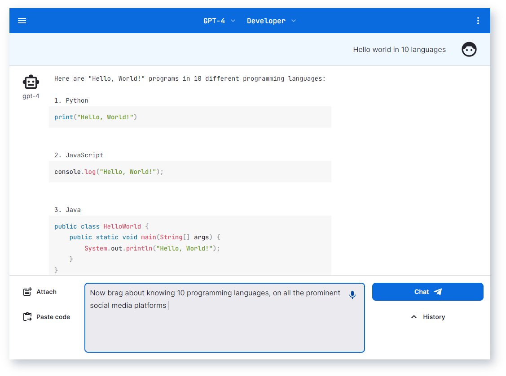

# Next.js ChatGPT 🤖💬

Welcome to `ChatGPT-App`! 🎉🚀 Responsive chat application powered by OpenAI's GPT-4, with chat streaming, code
highlighting, code execution, development presets, and more. The app is built using Next.js and TypeScript, and it's
designed to be easy to use, customize, and extend. We encourage you to contribute and help improve this project! 😊

## Why this? 💡

Because the official Chat is ___slower than the API___, and the Playground UI ___doesn't even highlight code___.



## Integrations 🤝

| Integration                          | Description                | Docs                                                   |
|:-------------------------------------|:---------------------------|:-------------------------------------------------------|
| [Helicone](https://www.helicone.ai/) | LLM Observability Platform | Settings Menu > Advanced > API Host: 'oai.hconeai.com' |
| [Paste.gg](https://paste.gg/)        | Paste Sharing              | Chat Menu > Share via paste.gg                         |

## Developing 🚀

Tech Stack 🛠️


Simply clone the repository, install the dependencies, and run the development server:

```
git clone https://github.com/goldpal/ChatGPT-App.git
cd ChatGPT-App
npm install
npm run dev
```

Now the app should be running on `http://localhost:3000`.

## Contributing 🙌

The source code is Very Simple™ 😀. We'd love to have you contribute to this project! Feel free to fork the repository,
make changes, and submit a pull request. If you have any questions or need help, feel free to reach out to us.

This project is licensed under the MIT License.


---

[](https://github.com/goldpal/ChatGPT-App/stargazers)
[](https://github.com/goldpal/ChatGPT-App/network)
[](https://github.com/goldpal/ChatGPT-App/issues)
[](https://github.com/goldpal/ChatGPT-App/pulls)
[](https://github.com/goldpal/ChatGPT-App/LICENSE)
[](https://twitter.com/goldpal)

Made with 💙
